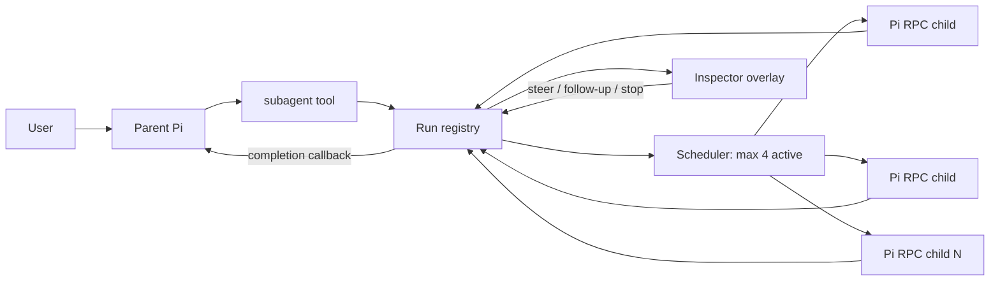

# Minimal Asynchronous RPC Subagent Extension

## Status

Approved implementation specification.

This document replaces the earlier foreground/process-mode design. The previous design is preserved in [`SUBAGENT-SPEC.legacy.md`](SUBAGENT-SPEC.legacy.md).

## Goal

Keep Pi's small example subagent extension, but make delegation non-blocking and pleasant to inspect:

```text
one tool → one session-local scheduler → independent Pi RPC children
```

A subagent launch returns immediately. The parent Pi remains usable while children run, receives results automatically when they finish, and can inspect or steer live children through a small TUI overlay.

## Design principles

- Background by default.
- No orchestration framework.
- No speculative delegation.
- Parent and child processes remain isolated.
- One shared control path for model-driven and user-driven steering.
- Children are owned by the current parent session and never become silent orphans.
- Keep the implementation session-local and ephemeral until persistence is demonstrably needed.

## Non-goals

The first version does not provide:

- Watchdogs or adversarial review policies
- Missions, schedules, or durable jobs
- Persistent run recovery after Pi exits or reloads
- Nested subagents
- Automatic review loops
- Worktree management
- Agent profiles beyond the existing Markdown definitions
- A general workflow language
- Fleet infrastructure outside the current Pi session
- Attaching a terminal directly to a child process
- Switching the parent into a running child's session

## User experience

### Launch

The parent calls the existing `subagent` tool:

```ts
subagent({
  agent: "scout",
  task: "Find the authentication entry points",
})
```

The tool returns immediately:

```text
Started scout in background: run 8f31c2a4
```

The parent may continue working or return control to the user. It must not poll or sleep merely to wait for the child.

### Completion

When a background run settles, the extension injects one completion message into the parent:

```ts
pi.sendMessage(message, {
  deliverAs: "followUp",
  triggerTurn: true,
})
```

Consequences:

- If the parent is busy, the result waits until the parent finishes its current run.
- If the parent is idle, the result wakes it.
- The result becomes part of parent context.
- The result is visibly rendered in the parent transcript.
- Exactly one callback is emitted per top-level run.

### Inspector

A compact widget below the editor shows current activity:

```text
subagents  2 running · 1 queued · ← inspect
```

The inspector opens through either:

- `Left` while the editor is empty
- `/subagents`

`Left` retains normal cursor behavior whenever the editor contains text.

Inspector controls:

| Key | Action |
|---|---|
| `Up` / `Down` | Select a run |
| `Right` / `Enter` | Open the selected live transcript |
| `Left` / `Escape` | Return to the run list or close |
| `S` | Enter a steering message |
| `D` | Stop the selected run |

The inspector is an overlay. It never replaces the parent session.

## Tool API

### Execution modes

Existing execution shapes remain supported.

#### Single

```ts
subagent({
  agent: string,
  task: string,
  cwd?: string,
  background?: boolean,
})
```

#### Parallel

```ts
subagent({
  tasks: Array<{
    agent: string,
    task: string,
    cwd?: string,
  }>,
  background?: boolean,
})
```

#### Chain

```ts
subagent({
  chain: Array<{
    agent: string,
    task: string,
    cwd?: string,
  }>,
  background?: boolean,
})
```

`{previous}` in a chain task is replaced with the prior step's final output.

`background` defaults to `true`. `background: false` is the explicit foreground escape hatch and waits for the same run machinery to settle.

Exactly one execution shape must be supplied.

### Control actions

The same tool exposes a small management surface:

```ts
subagent({ action: "status", id?: string })
subagent({ action: "steer", id: string, message: string })
subagent({ action: "follow_up", id: string, message: string })
subagent({ action: "stop", id: string })
```

Rules:

- `status` without an ID lists current-session runs.
- `status` with an ID returns one run's state and bounded transcript tail.
- `steer` sends guidance at the next safe steering boundary.
- `follow_up` queues work after the child's current work finishes.
- `stop` removes queued work or terminates active child processes.
- Control actions cannot be mixed with execution fields.

The parent orchestrator and the human inspector both call the same internal control functions. There is no separate steering implementation for the UI.

## Eagerness policy

The model-facing tool description must explicitly say:

- Delegate when the user requests it or when delegation has a clear, immediate benefit.
- Do not launch speculative reviewers, scouts, or workflows.
- Do not poll running children.
- Do not steer a child without new, relevant information.
- A completion callback is a result to consume, not an invitation to launch more children.

No automatic supervisor loop watches and redirects children. The orchestrator may steer only when it has a concrete reason, and the user may steer manually from the inspector.

## Runtime architecture



### Run registry

The extension keeps a session-local in-memory registry:

```ts
type RunState = "queued" | "running" | "completed" | "failed" | "stopped";

type RunRecord = {
  id: string;
  mode: "single" | "parallel" | "chain";
  state: RunState;
  createdAt: number;
  startedAt?: number;
  endedAt?: number;
  children: ChildRecord[];
  result?: string;
  error?: string;
  callbackDelivered: boolean;
};
```

Each child records:

- Agent name and task
- Queue/running/terminal state
- RPC process handle
- Current tool and recent activity
- Bounded transcript
- Final assistant output
- Usage and model when available
- Error or stop reason

Run IDs are opaque and unique within the parent process.

### Scheduler

The scheduler permits at most four active child Pi processes across the current parent session.

- Additional children remain queued.
- Parallel tasks may request any allowed task count, but only four execute concurrently.
- A chain queues only its current step; its next step becomes eligible after the current one succeeds.
- A stopped top-level run removes all of its queued children and terminates its active children.
- A failed chain does not start later steps.
- Scheduler capacity is released only after child process termination is observed.

## RPC child process

Each child starts as an owned process:

```text
pi --mode rpc --no-session --no-extensions --no-prompt-templates ...
```

Additional arguments apply the selected agent's:

- Model override, when present
- Thinking level inherited from the parent when the agent does not pin one
- Tool allowlist
- System prompt
- Working directory

Disabling extension discovery prevents recursive subagent tools, hidden child dialogs, and unrelated global extension behavior. The child receives only its requested built-in tools and agent prompt.

Children use `--no-session`; their state exists only for the lifetime of the run. Completed children are terminated rather than retained for later revival.

### RPC transport

The parent writes strict JSONL commands to child stdin and reads strict JSONL events from child stdout.

Do not use Node's generic `readline` splitter because RPC framing permits Unicode line separator characters inside JSON strings. Split only on LF (`\n`) and strip one trailing CR when present.

Commands used:

```json
{"id":"...","type":"prompt","message":"initial task"}
{"id":"...","type":"steer","message":"new guidance"}
{"id":"...","type":"follow_up","message":"additional work"}
{"id":"...","type":"abort"}
{"id":"...","type":"get_state"}
```

Events consumed include:

- `response`
- `agent_start`
- `agent_settled`
- `message_start`
- `message_update`
- `message_end`
- `tool_execution_start`
- `tool_execution_update`
- `tool_execution_end`
- `queue_update`
- `extension_error`

Request IDs correlate commands with acceptance or failure responses. A successful command response means Pi accepted or queued it; terminal failures still arrive through normal events.

### Child completion

A child is complete after `agent_settled` and any previously accepted follow-up queue has drained. The runner then:

1. Captures the final assistant text.
2. Marks the child terminal.
3. Gracefully terminates the RPC process.
4. Releases its scheduler slot after process close.
5. Advances a chain or aggregates a parallel run.
6. Emits the top-level callback once the entire run is terminal.

Unexpected process exit before settlement fails the child with captured stderr and the latest bounded output.

## Transcript handling

The inspector transcript is assembled from RPC events and includes:

- Assistant text
- Tool names and concise argument previews
- Tool completion/failure state
- Steering and follow-up acknowledgements
- Process errors

Limits:

- Keep a bounded in-memory transcript per child.
- Bound stderr separately.
- Bound completion text before injecting it into parent context.
- Indicate truncation explicitly.
- Do not persist transcripts in the first version.

## Rendering

### Tool result

A background launch renders a compact receipt with:

- Run ID
- Mode
- Agent or child count
- Queue/running state

Foreground execution reuses the current rich final-result rendering.

### Completion message

Register a custom message renderer for subagent completion callbacks. The collapsed view shows status and agent names; the expanded view shows the bounded result.

### Widget

The widget appears only while queued/running work exists or until a newly completed run has been observed. It updates when registry state changes and clears on session shutdown.

### Editor integration

Wrap the currently configured editor instead of blindly replacing it.

- When the editor is empty and receives `Left`, open the inspector.
- Otherwise delegate input unchanged to the wrapped editor.
- Preserve existing editor keybindings and behavior.
- `/subagents` remains available if another editor implementation cannot be safely wrapped.

## Lifecycle

Children are owned and ephemeral.

On normal completion:

- Terminate the settled child process.
- Retain bounded run metadata in memory for the remainder of the parent session.

On `session_shutdown`, including reload, new session, resume, fork, or process exit:

- Stop accepting new runs.
- Remove queued children.
- Send abort to active RPC children.
- Escalate to process termination after a short grace period.
- Clear registry UI and timers.
- Do not emit callbacks into a stale parent session.

Known first-version limitation: `/reload` and session switching cancel active subagents because there is no durable recovery layer.

## Error handling

Report clear failures for:

- Missing or invalid execution mode
- Unknown agent
- Invalid control action or run ID
- Child startup failure
- Missing RPC command acknowledgement
- Malformed or oversized RPC output
- Unexpected child exit
- Failed steering/follow-up acceptance
- Parent shutdown cancellation

Never convert a failed child into a successful empty result.

Parallel runs aggregate every child outcome. Chain runs stop at the first failed or stopped step.

## Security and isolation

- Child commands use argument arrays with `shell: false`.
- Agent names never become executable paths.
- Temporary system-prompt files use private permissions and are removed.
- Child extension discovery is disabled.
- Tool access comes only from the selected agent's allowlist.
- Child output is untrusted and bounded before rendering or injecting into context.
- RPC parser failures terminate the affected child rather than desynchronizing the stream.

Tool restrictions are capability reduction, not an operating-system sandbox.

## Files

Expected implementation layout:

```text
extensions/subagent/
  index.ts          tool registration, registry coordination, callbacks
  agents.ts         existing agent discovery
  rpc-runner.ts     strict RPC transport and child lifecycle
  inspector.ts      widget, editor hook, and overlay
```

The existing extension symlinks must be replaced with regular local files before modification.

## Validation

Add focused runnable checks for:

- LF-only JSONL framing across arbitrary chunk boundaries
- Optional CR stripping
- Malformed and oversized records
- RPC request/response correlation
- Initial prompt acceptance
- Steering and follow-up dispatch
- Four-child concurrency cap and queue advancement
- Single, parallel, and chain completion
- Chain `{previous}` substitution
- Stop behavior for queued and running children
- Unexpected child exit
- Completion callback emitted exactly once
- No callback after parent shutdown
- Empty-editor `Left` interception and normal non-empty cursor behavior

## Acceptance criteria

- A background launch returns a run ID without waiting for model completion.
- The parent remains available while children run.
- No more than four child Pi processes run concurrently.
- Single, parallel, and chain modes all execute through the scheduler.
- The parent receives one automatic completion callback per top-level run.
- A busy parent receives the callback as a follow-up rather than a mid-turn interruption.
- `/subagents` opens a live inspector.
- Empty-editor `Left` opens the same inspector without breaking normal cursor movement.
- The inspector can view transcripts, steer, queue follow-ups, and stop runs.
- The parent orchestrator can use the same control operations.
- Active children terminate on parent session shutdown.
- No watchdog, mission, schedule, worktree, nested-agent, or durable recovery subsystem is introduced.
